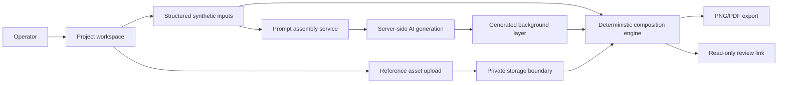

# Redacted Architecture Diagram

This diagram describes the public-safe system shape without exposing production source, private storage paths, credentials, vendor records, or internal workflow details.

## Boundary Notes

- API keys stay server-side.
- Uploaded assets stay inside the private storage boundary.
- Public examples use synthetic products, synthetic partners, and placeholder event details.
- The generated image is only one layer. Final copy, logo placement, product framing, export dimensions, and review rules are deterministic.

