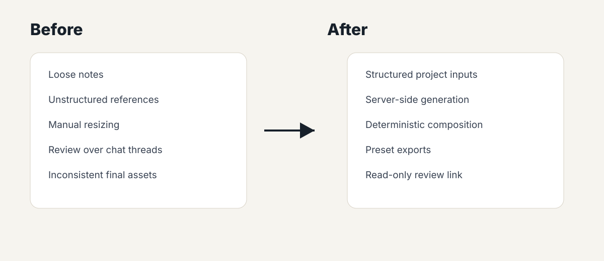

# Synthetic Before/After Asset Flow

This flow uses fake product and partner names. It is meant to explain the workflow shape, not reveal production data.

## Before

```text
Event details: Friday tasting, 4-7 PM
Partner: Northstar Market
Product: Citrus Cloud Pre-Roll
Message: New seasonal drop
References: product photo, partner logo, brand palette
Output need: square social post + story post + printable flyer
```

Typical pain points:

- Event details arrive as loose notes.
- Brand and partner requirements are easy to miss.
- A generated image alone is not a finished asset.
- Different output sizes need consistent layout rules.
- Review links should not expose editing access or raw uploads.

## After

```text
1. Structured inputs normalize event, partner, product, and message details.
2. AI creates a background concept from approved context.
3. The composition engine places title, partner, product, legal/footer space, and callouts.
4. Export presets create square, story, and print-ready versions.
5. A read-only review link is shared for approval.
```

## Public-Safe Example

| Input | Synthetic Value |
|---|---|
| Partner | Northstar Market |
| Product | Citrus Cloud Pre-Roll |
| Event | Sunset Product Spotlight |
| Date | June 14 |
| CTA | Ask about the seasonal drop |
| Export sizes | Square, story, print flyer |



