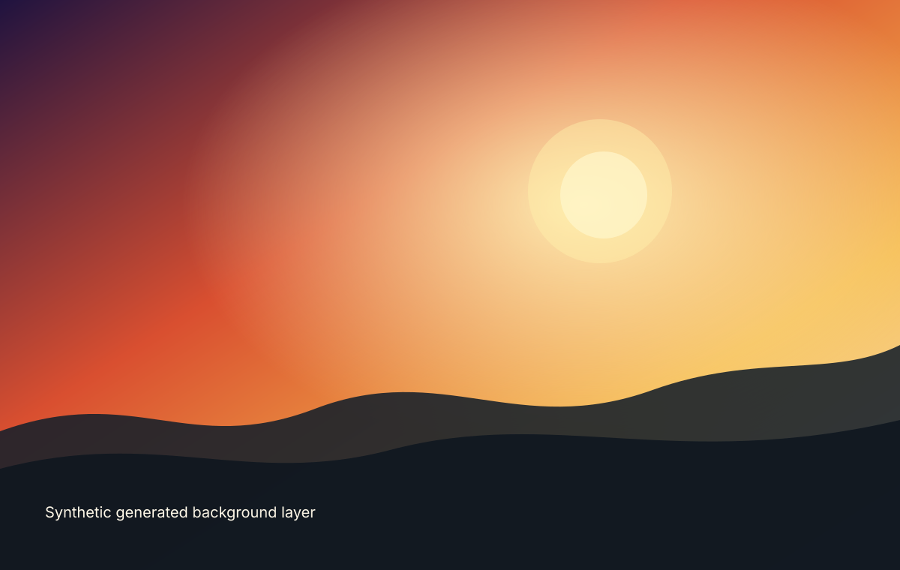
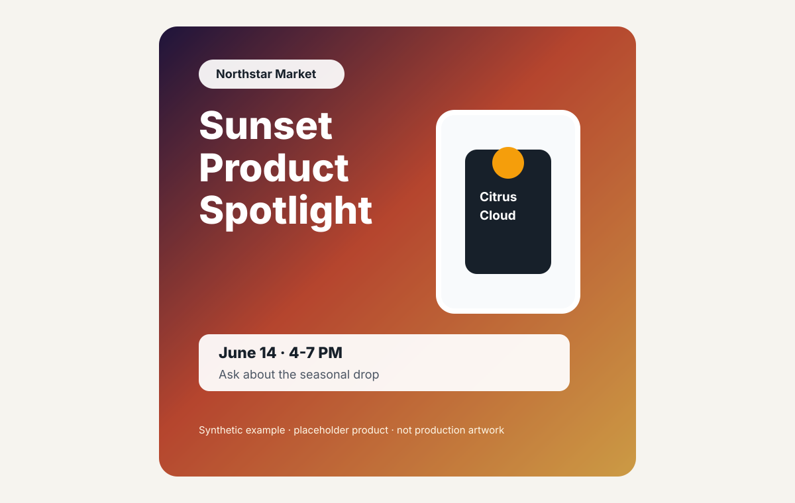

# Generated Background And Deterministic Layout

The workflow separates creative generation from final composition.

## Generated Background Example

The background is expressive and flexible. It can explore mood, color, lighting, and visual direction without deciding final business-critical layout.

## Deterministic Final Layout Example

The final layout uses fixed rules for title placement, partner/product framing, logo safe areas, CTA placement, footer space, and export dimensions.

## Why Generation And Final Composition Are Separate

AI generation is useful for visual exploration, but it is not reliable enough to own final production layout by itself.

The split matters because:

- Brand, partner, product, and event information must remain legible.
- Output sizes need predictable safe areas.
- Reviewers need consistent versions across square, story, and print formats.
- Legal/footer space should not be accidentally covered.
- Product and partner details should come from structured inputs, not model guesses.
- A regenerated background should not move approved text or change export rules.

In this model, AI creates a visual layer. The composition engine turns approved inputs and assets into repeatable final outputs.

