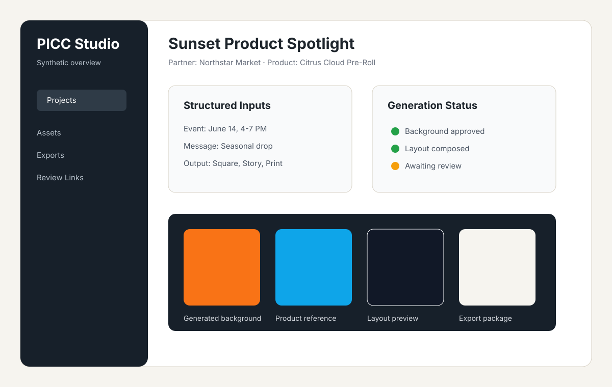

# Placeholder Product And Partner Screens

These screens are intentionally synthetic. They are not production screenshots, and they do not contain real customer records, uploaded assets, private product documents, or internal notes.

## Project Dashboard

The dashboard screenshot shows the intended workspace shape: project status, required inputs, asset previews, and export readiness.

## Review Output

The final-layout screenshot shows how a generated background can be reused behind deterministic layout rules.

## Placeholder Dataset

| Field | Value |
|---|---|
| Partner | Northstar Market |
| Product | Citrus Cloud Pre-Roll |
| Campaign | Sunset Product Spotlight |
| Status | Ready for review |
| Export | Square social post |

